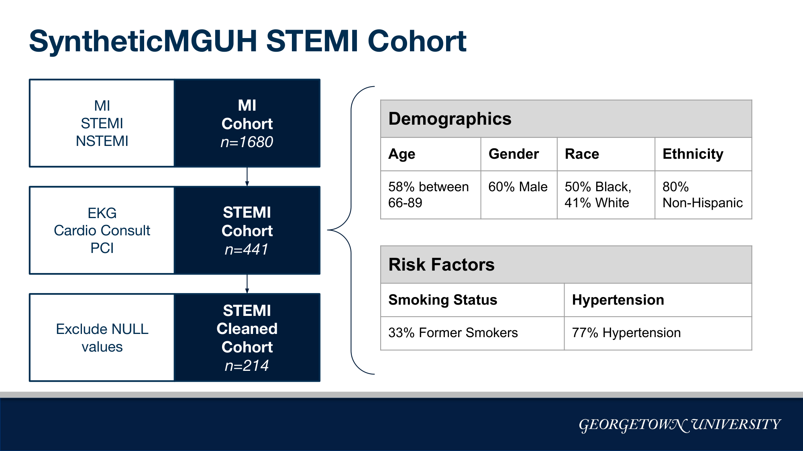
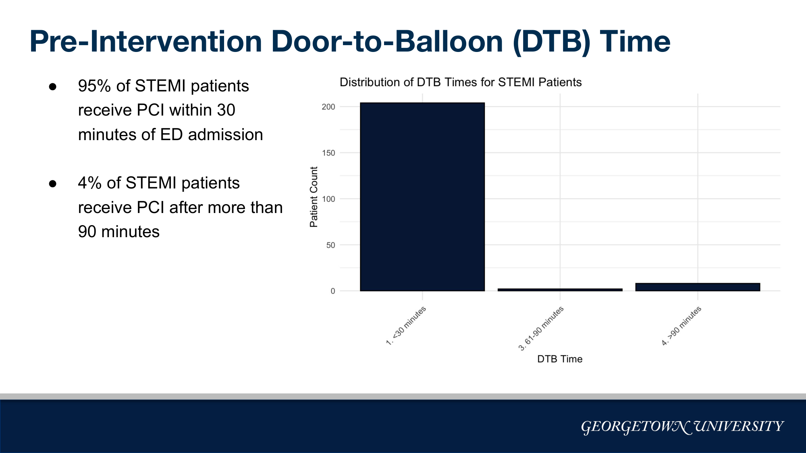
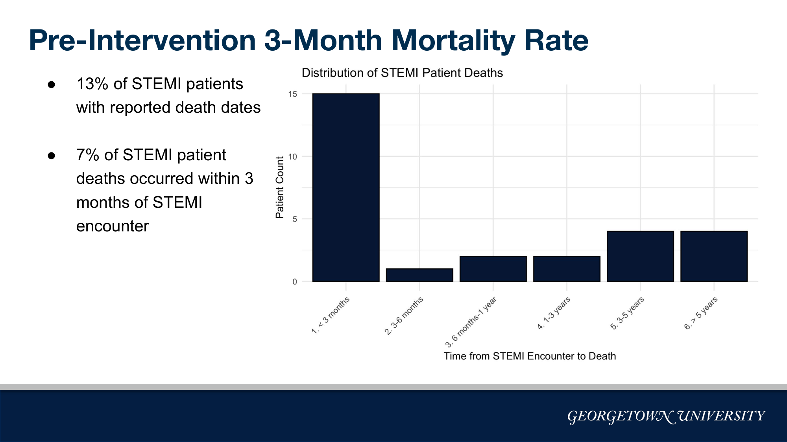
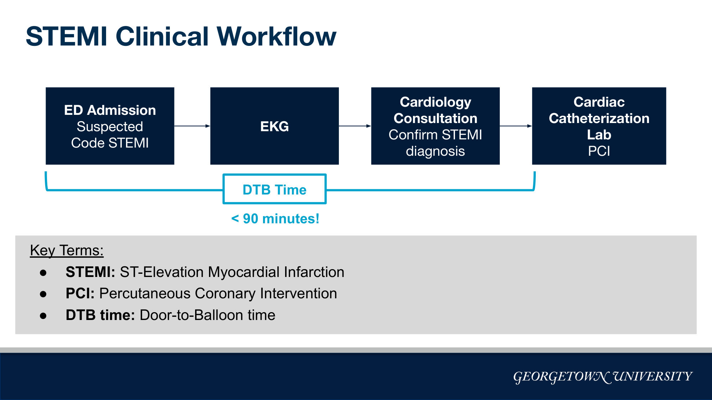
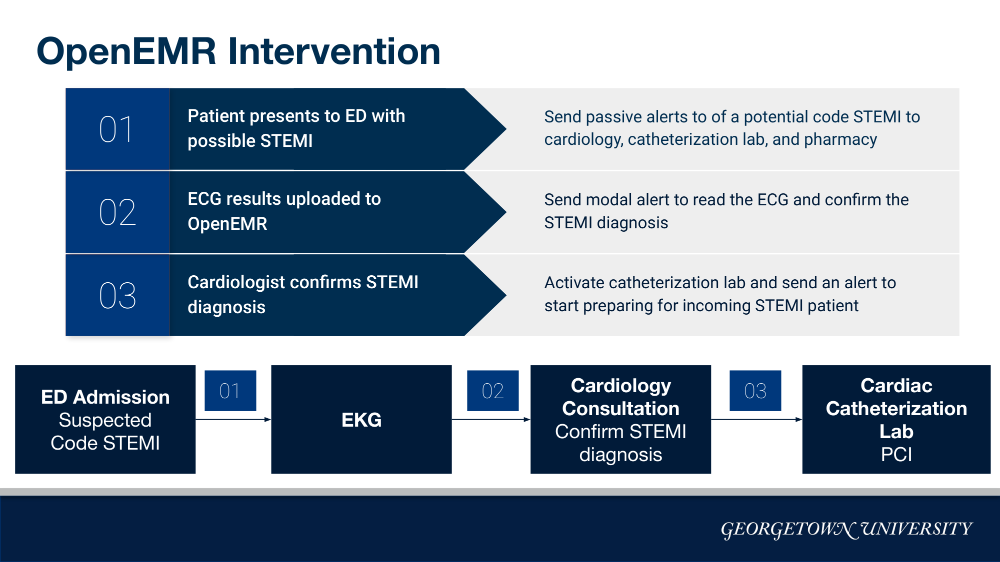

# Streamlining STEMI Care: A Data-Driven Quality Improvement Study and Clinical Decision Support Intervention

**Reducing door-to-balloon (DTB) time for ST-elevation myocardial infarction patients through cohort analysis on a live PostgreSQL EHR database, a working OpenEMR clinical decision support build, and a quantitative staff-adoption evaluation.**

Authors: Jay Nagabhairu, Stephanie Araki, Maxwell Lewis, Pari Shah

---

## Abstract

ST-elevation myocardial infarction (STEMI) is a time-critical cardiac emergency in which mortality rises sharply with every additional minute between a patient's arrival at the emergency department and the restoration of blood flow via percutaneous coronary intervention (PCI). Clinical guidelines set a 90-minute door-to-balloon (DTB) benchmark; the outcomes literature (McNamara et al., 2006, *Journal of the American College of Cardiology*) directly links delays past this threshold to increased mortality.

This project runs the full cycle of a hospital quality-improvement (QI) initiative against a synthetic hospital electronic health record (EHR) database: cohort construction and baseline measurement via SQL, an implemented (not hypothetical) clinical decision support (CDS) intervention inside OpenEMR, and a post-intervention evaluation spanning workflow timing, implementation cost, training burden, and a quantitative staff-adoption survey processed with an NLP pipeline. The full source and reference PDF are included in this repository at [`docs/mcnamara_2006_dtb_mortality.pdf`](docs/mcnamara_2006_dtb_mortality.pdf).

Findings: at baseline, 95% of the STEMI cohort reached PCI within 30 minutes of EKG start and 96% met the 90-minute guideline, with near-universal (99%) medication compliance and 100% troponin testing compliance. Because the underlying environment is synthetic data, baseline performance already looked strong by several measures — so the project used the small pool of delayed patients as the entry point for a real intervention, then built out the full downstream evaluation a hospital QI team would need to actually decide whether to keep, expand, or roll back the change. The staff survey surfaced a genuine adoption gap (strong perceived patient-care benefit, but low ease-of-learning and ease-of-implementation scores), which directly shaped the final recommendation for an incremental rather than hospital-wide rollout.

## Table of Contents

1. [Clinical Motivation](#clinical-motivation)
2. [Data Source](#data-source)
3. [Methods](#methods)
4. [Results](#results)
5. [Intervention: OpenEMR Clinical Decision Support Build](#intervention-openemr-clinical-decision-support-build)
6. [Evaluation](#evaluation)
7. [Recommendations](#recommendations)
8. [Repository Structure](#repository-structure)
9. [Reproducing This Analysis](#reproducing-this-analysis)
10. [Technical Skills Demonstrated](#technical-skills-demonstrated)
11. [References](#references)

## Clinical Motivation

STEMI care is a race against ischemic time. From the moment a patient presents at the emergency department (ED), every step in the chain — EKG acquisition, cardiology confirmation, cath lab activation, and PCI — is a place where delay can accumulate, and a well-designed alerting system can close the gap. The 90-minute DTB benchmark, set by AHA/ACC guidelines and supported by the outcomes literature, is the industry-standard yardstick for whether a hospital's STEMI workflow is performing.

## Data Source

Analysis ran directly against a live PostgreSQL instance of a synthetic hospital database (built on [Synthea](https://github.com/synthetichealth/synthea/wiki/CSV-File-Data-Dictionary)-generated patient records), queried via SQL embedded in a Quarto (`.qmd`) notebook. Using synthetic rather than real patient data allowed the project to demonstrate a full, unrestricted QI workflow, cohort construction, quality metric calculation, dashboarding, and a live EHR intervention, without any PHI exposure or IRB overhead.

## Methods

### Cohort Construction

The analytic cohort was built in three progressively narrower stages:

| Stage | Definition | Patients |
|---|---|---|
| **MI cohort** | Patients with a myocardial infarction encounter, condition, or procedure (SNOMED-CT `22298006`, `401303003`, `401314000`), excluding those with only a *history* of prior MI | 1,680 |
| **STEMI cohort** | MI cohort patients with a documented EKG, a cardiology consultation, and a PCI procedure | 441 (~26% of MI cohort) |
| **STEMI timeline cohort** | STEMI patients with a complete, internally consistent event timeline (non-negative step durations, all steps in the same calendar year, total DTB under 24 hours) | 214-215 |

Full SQL is in [`sql/01_mi_cohort.sql`](sql/01_mi_cohort.sql) and [`sql/02_stemi_cohort.sql`](sql/02_stemi_cohort.sql).

### Cohort Demographics and Risk Factors



58% of the STEMI cohort was between 66 and 89 years old, 60% were male, race was split roughly between Black (50%) and White (41%) patients, 80% identified as non-Hispanic, 33% were former smokers, and 77% carried a hypertension diagnosis — a risk profile consistent with the published STEMI population. Full query set: [`sql/03_cohort_demographics.sql`](sql/03_cohort_demographics.sql).

### Quality Metric Calculation

A per-patient event timeline (ED admission → EKG → cardiology consult → PCI) was assembled directly in SQL using window functions (`ROW_NUMBER() OVER`) to pick the most recent procedure of each type, and interval arithmetic to compute step durations and total DTB time. See [`sql/04_stemi_timeline_dtb.sql`](sql/04_stemi_timeline_dtb.sql), [`sql/05_medication_compliance.sql`](sql/05_medication_compliance.sql), and [`sql/06_mortality_and_troponin.sql`](sql/06_mortality_and_troponin.sql).

```
ED Admission → EKG → Cardiology Consultation → PCI
              |________________ DTB Time ________________|
```

## Results

### Baseline (Pre-Intervention) Quality Metrics



| Metric | Result |
|---|---|
| DTB time under 90 minutes | 96% (95% under 30 minutes) |
| Medication compliance (DAPT, high-intensity statins, beta-blockers within 24h) | ~99% |
| Troponin testing during STEMI encounter | 100% |
| 3-month mortality (all timeline patients) | 7% |



Of the 8 patients whose DTB time exceeded the 90-minute guideline, one had a reported death within 3 months — too small a signal to draw a firm DTB-to-mortality conclusion in this cohort, a limitation the analysis states explicitly rather than overselling a marginal finding. Rather than treating strong baseline numbers as a dead end, the small delayed-patient pool became the entry point for a concrete workflow intervention.

## Intervention: OpenEMR Clinical Decision Support Build

Rather than stopping at a slide describing a hypothetical fix, the intervention was implemented and validated as three live clinical decision support rules directly inside OpenEMR:





1. **Code STEMI alert** — On a new ED encounter with an MI problem code, passive alerts fire to cardiology, the cath lab, and pharmacy that a potential STEMI is in-house.
2. **EKG confirmation alert** — When EKG results are uploaded (into a purpose-built "ECG Results" document category), a modal alert prompts the cardiologist for an immediate read and STEMI confirmation.
3. **Cath lab activation** — Once the cardiologist confirms the diagnosis, the cath lab is alerted and begins preparing for the incoming patient.

Each rule was validated inside the live EHR by confirming its clinical reminder correctly flipped from "Due" to "Not Due" once the corresponding action was acknowledged within the target window — a functioning rule set, not a paper design. Full build screenshots: [`docs/openemr_cds_rule_screenshots.pdf`](docs/openemr_cds_rule_screenshots.pdf).

## Evaluation

A complete evaluation package was assembled spanning cost, training burden, post-intervention workflow timing, and staff sentiment — the human-factors data that determines whether a clinical intervention survives contact with a real care team.

| Category | Detail |
|---|---|
| **Implementation cost** | $70,500 total — developer fees ($20K), additional transport staff ($18K), staff training ($2.5K), a data analyst ($15K), recurring feedback meetings ($15K). ([`data/Cost_Data.csv`](data/Cost_Data.csv)) |
| **Training burden** | 30 nurses, 8 cardiologists, 12 transport staff, 13 admin staff, 2 hours each. ([`data/Training_Data.csv`](data/Training_Data.csv)) |
| **Post-intervention DTB (weekly monitoring)** | 72.16% of encounters met the 90-minute benchmark; avg. time-to-ECG 6.08 min, time-to-consult 14.63 min, consult duration 15.00 min, time-to-PCI 51.96 min. ([`data/Weekly_DTB_Report.csv`](data/Weekly_DTB_Report.csv)) |
| **Staff survey** (n=63, 1-5 Likert + free text) | Improved patient care 4.08/5, easier for nurses 4.25, easier for cardiologists 4.02, timely notifications 3.90-3.97. Ease of learning **2.57** and ease of implementation **2.56** were notably lower, echoed directly in free-text comments ("notifications could be clearer"). ([`data/Updated_STEMI_Survey_Responses.csv`](data/Updated_STEMI_Survey_Responses.csv)) |

Free-text survey comments were processed through a Python NLP pipeline (tokenization, stopword removal, lemmatization via `nltk`) into a word-frequency table that feeds a Tableau word cloud — see [`nlp/survey_comment_nlp.py`](nlp/survey_comment_nlp.py).

This is an honest, data-backed adoption finding rather than a uniformly positive result: strong perceived clinical benefit paired with a real usability gap, and it directly shaped the rollout recommendation below.

## Recommendations

1. Establish a dedicated STEMI response team (specialized transport, training, and cath lab staff).
2. Expand post-discharge follow-up with more frequent telehealth check-ins (2 weeks and 1 month).
3. Hold biweekly administrative review of STEMI metrics.
4. Roll the intervention out incrementally rather than hospital-wide, directly addressing the ease-of-learning and ease-of-implementation gap surfaced by the staff survey.

## Repository Structure

```
.
├── README.md
├── notebook/
│   ├── stemi_qi_report.qmd       # Full Quarto notebook: narrative + embedded SQL + R/ggplot2
│   └── export_and_plots.R        # R export and visualization snippets
├── sql/
│   ├── 01_mi_cohort.sql
│   ├── 02_stemi_cohort.sql
│   ├── 03_cohort_demographics.sql
│   ├── 04_stemi_timeline_dtb.sql
│   ├── 05_medication_compliance.sql
│   └── 06_mortality_and_troponin.sql
├── nlp/
│   └── survey_comment_nlp.py     # Survey comment tokenization/lemmatization pipeline
├── dashboard/
│   └── stemi_dashboard.twb       # Tableau workbook (pre vs. post intervention metrics)
├── data/
│   ├── Cost_Data.csv
│   ├── Training_Data.csv
│   ├── Weekly_DTB_Report.csv
│   ├── Updated_STEMI_Survey_Responses.csv
│   ├── processed_survey_responses.csv
│   ├── stemi_timeline_pre_intervention.csv
│   └── stemi_timeline_post_intervention.csv
├── docs/
│   ├── openemr_cds_rule_screenshots.pdf
│   └── mcnamara_2006_dtb_mortality.pdf
└── assets/                       # Figures referenced in this README
```

All data in this repository is synthetic (Synthea-generated) or project-internal (cost, training, survey figures); no real patient information is included.

## Reproducing This Analysis

The SQL in `sql/` was originally run against a PostgreSQL instance provisioned for this project and is not publicly hosted. To reproduce the pipeline against your own Synthea-loaded PostgreSQL database:

```bash
# 1. Load a Synthea-generated dataset into PostgreSQL
#    https://github.com/synthetichealth/synthea

# 2. Run the SQL scripts in order against your database
psql -h <host> -U <user> -d <database> -f sql/01_mi_cohort.sql
psql -h <host> -U <user> -d <database> -f sql/02_stemi_cohort.sql
psql -h <host> -U <user> -d <database> -f sql/03_cohort_demographics.sql
psql -h <host> -U <user> -d <database> -f sql/04_stemi_timeline_dtb.sql
psql -h <host> -U <user> -d <database> -f sql/05_medication_compliance.sql
psql -h <host> -U <user> -d <database> -f sql/06_mortality_and_troponin.sql

# 3. Open notebook/stemi_qi_report.qmd in RStudio/Positron to render
#    the full narrative report with embedded results and plots

# 4. Run the NLP pipeline on the staff survey
cd nlp && pip install -r requirements.txt
python survey_comment_nlp.py --input ../data/Updated_STEMI_Survey_Responses.csv --output wordcloud_data.csv

# 5. Open dashboard/stemi_dashboard.twb in Tableau Desktop/Public
```

## Technical Skills Demonstrated

- **SQL against a live PostgreSQL database**: multi-table joins across encounters, conditions, procedures, medications, and patients; common table expressions; window functions (`ROW_NUMBER() OVER`, `SUM() OVER`); temporary tables; date/interval arithmetic for cohort and duration calculations.
- **Clinical coding standards**: SNOMED-CT diagnosis/procedure codes and medication code sets used to define cohorts and compliance criteria directly from guideline language.
- **EHR system configuration**: building and validating live clinical decision support rules (alerts, clinical reminders, document categories) inside OpenEMR.
- **Business intelligence and dashboarding**: a Tableau dashboard built from exported SQL query results, visualizing pre- vs. post-intervention metrics.
- **Applied NLP**: Python (`nltk`) tokenization, stopword removal, and lemmatization of free-text survey comments to support a word cloud visualization.
- **Reproducible reporting**: a Quarto (`.qmd`) notebook combining narrative, embedded SQL, and R/`ggplot2` visualizations into a single self-contained report.
- **Program evaluation**: cost accounting, training burden estimation, and Likert-scale survey analysis tied back to concrete workflow recommendations.

## References

McNamara RL, Wang Y, Herrin J, Curtis JP, Bradley EH, Magid DJ, Peterson ED, Blaney M, Frederick PD, Krumholz HM; NRMI Investigators. Effect of door-to-balloon time on mortality in patients with ST-segment elevation myocardial infarction. *J Am Coll Cardiol*. 2006. Full text: [`docs/mcnamara_2006_dtb_mortality.pdf`](docs/mcnamara_2006_dtb_mortality.pdf).

American Heart Association / American College of Cardiology STEMI Guidelines: https://www.ahajournals.org/doi/10.1161/cir.0b013e3182742cf6

Synthea synthetic patient generator: https://github.com/synthetichealth/synthea
